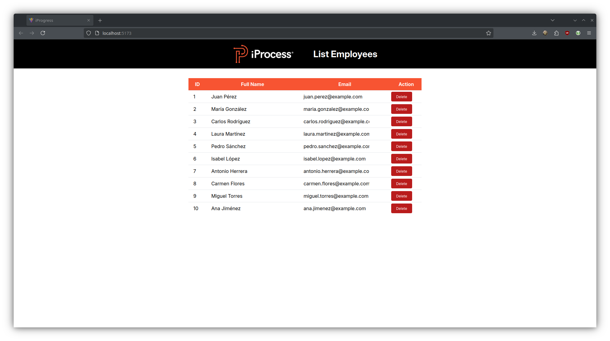

# Prueba Técnica - Desarrollador Frontend Junior

## Descripción

Esta aplicación web se divide en dos partes autónomas y tiene como objetivo demostrar la implementación de un CRUD.

### 1. Backend:

Se ha construido una API utilizando Node.js, Express y JSON.

### 2. Frontend:

Proporciona una interfaz visual que permite a los usuarios interactuar con la aplicación. Desarrollado utilizando:

- React
- React Router DOM
- Axios
- tanstack/react-table
- react-toastify

## Capturas de Pantalla

