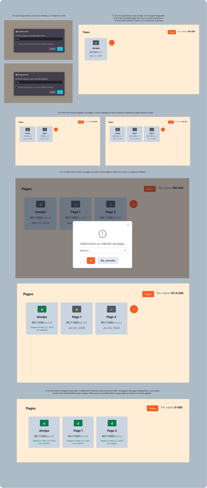

# Prueba Técnica para Programador/a Jr Front-End en iProcess

Este repositorio contiene mi solución a la prueba técnica para el puesto de programador/a jr front-end en iProcess. La prueba consistía en implementar un diseño en React para crear una distribución de pagos según un flujo dado.

## Descripción del Proyecto

El objetivo principal de este proyecto es permitir que un usuario pueda crear varias cuotas de pago a partir de un total predefinido. Cada cuota tiene un estado (pendiente o pagado) y una fecha de pago asociada.

## Requerimientos

La prueba incluyó los siguientes requerimientos:

1. **Leer toda la información antes de empezar a codificar.**
2. **Uso de Git:**
   - Los commits reflejan el progreso de creación de la aplicación.
3. **Componente React "Pagos":**
   - Implementar el diseño de flujo dado de forma interactiva.
   - Garantizar que todas las funcionalidades especificadas funcionen correctamente.
4. **Total Inmutable:**
   - El precio total de $182 USD no es editable, pero se puede recibir como una prop para cambiar el valor al iniciar la aplicación.
5. **Moneda Constante:**
   - La moneda "USD" no es modificable dentro de la aplicación, pero debe ser una constante en el código. Si cambia a "COP", toda la visual debe cambiar al iniciar la aplicación.
6. **Suma de Pagos:**
   - Los pagos creados siempre deben sumar el 100%, ni más ni menos.
7. **División de Pagos:**
   - Al crear un nuevo pago, se debe dividir el pago anterior a la mitad.

## Tecnologías Utilizadas

- React
- Redux
- JavaScript
- HTML
- CSS
- Tailwind

## Instalación y Uso

1. Clona este repositorio en tu máquina local.
2. Instala las dependencias utilizando el comando `npm install`.
3. Inicia la aplicación con el comando `npm run dev`.
4. Abre tu navegador y ve a `http://localhost:5173` para ver la aplicación en acción.

## Extras Opcionales

Los extras opcionales que implementé para mejorar mi solución fueron:

- Uso de Tailwind CSS para los estilos.
- Buenas practicas.

## Capturas de Pantalla

## Notas Adicionales

- Durante el desarrollo, dejé comentarios explicativos en el código para facilitar la comprensión.
- La aplicación está diseñada para cumplir con los requerimientos especificados en la prueba técnica.
